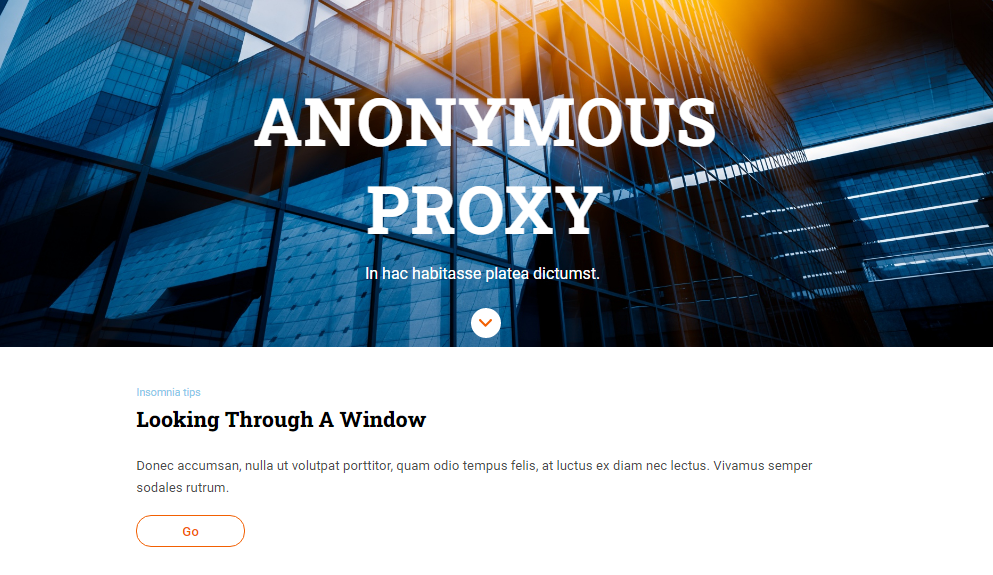

# Anonymus Proxy

La creadora de este proyecto ha sido **Nayra Romero - @nayraromero**

## 🚀 Introducción y 📝 requerimientos

En este repositorio puedes encontrar un proyecto generado en **el bootcamp de programación web de [Adalab](https://adalab.es/)**.
El objetivo principal ha sido crear una página web en base a un diseño que se nos dió por **[Zeplin.](https://zeplin.io/)**

> **NOTE:** El link directo a este proyecto es **[link](https://nayraromero.github.io/Anonymus-proxy/)**.

## 🛠️ Herramientas

Las tecnologías utilizadas durante este proyecto han sido:

- **HTML**
- **CSS Flexbox**
- **SASS**
- **Partials**
- **GIT version control**

## 💾 Pasos para utilizar este proyecto en vuestro ordenador:

1. Haz click en la esquina superior derecha del repositorio en el botón **Fork**.
2. Elige el usuario donde quieres ver el proyecto. **Choose your user**.
3. **Ve a github.com/usuario/nombre-del-proyecto**, **clónalo** y ya podrás visualizarlo.

**Muchas gracias** 🤗
